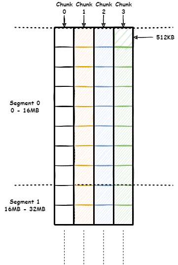

**TL;DR**

<!--more-->

## 场景

需要支持：
1. overwrite。
1. 多个 client 并发写。
1. RDMA read/write。
1. 高并发读取一个文件的不同区域。

workload 特点：
1. 真正的 overwrite 极少。
1. 读远多于写。
1. 遇到写失败时，server 可以放宽一致性要求，由 client 兜底。

## Overview

### 文件组织

每个文件对应若干个定长的 chunk，每个 chunk 可以有 K 个 replica，分布在不同的 target 上。chunk 是调度单位。

为了支持“高并发读取一个文件的不同区域”，每个文件会先按地址空间水平切分为若干个定长的 segment，每个 segment 内部再垂直切分为固定数量个 chunk。

上面这个例子中，文件先按 16MB 切分为若干个 segment，每个 segment 内再分成 4 个 chunk，每个 chunk 管理 8 个长度为 512KB 的 subrange。这样做的好处：
1. 通过 offset 可以唯一确定 chunk。
1. client 需要读大块数据时，可以根据 subrange 切分，从不同 target 并发读取，充分利用多台机器的带宽。

实际设计中，我们会选择使用更大的 chunk 与 segment，如：
1. 每个 subrange 仍然是 512KB。
1. 每个 chunk 管理 128 个 subrange（64MB）。
1. 每个 segment 包含 16 个 chunk（1GB）。

优点：
1. 更大的 chunk 意味着更少的 metadata，减轻 metadata 的管理负担。
1. 更大的 segment 意味着更高的读取并发，如 16 个 chunk 意味着可以 16 并发读取 8MB 的连续数据。

缺点：
1. 更大的 chunk 意味着更高的 replica 复制成本。
1. 更大的 segment 意味着更高的初始分配成本，尤其小文件较多时。

### 系统架构

系统中有若干个 storage server，每个 storage server 的每块盘为一个 target。每个 target 管理若干个 chunk。meta server 会指定其中一个 target 为 primary，其它 targets 为 secondary。

每个 target 的存储分为两类：
1. 每个 chunk 对应一个 local file。
1. 每个 target 维护一个小的 local kv engine（如 rocksdb），用于持久化 target 的各种 meta。

每个 storage server 与 management node 之间有心跳，相互之间不维护心跳。

### chunk metadata 管理

> 注意：segment 只是虚拟单位，不对应真正的 metadata。

每个 chunk 对应两类 metadata：
1. inodeid + index -> chunk_id。
1. chunk_id -> chunk_info，后者包含：replica -> target，每个 replica 的状态（online/offline），以及谁是 primary。

> 另一种思路是 chunk 不要有自己的 id，直接用 inodeid+index，但这样 truncate 就会比较复杂。

另外，每个 target 也要记录 target -> chunk_id。

> 我们的 meta server 是无状态的，没有 leader 概念，所以需要持久化 target -> chunk_id 的映射以加速 failover 时 offline replica 的操作。

## Details

### 一致性保证

1. client 如果写成功，则后续一定能读到此次写。
1. 多个 replica 中的相同区域如果初始状态一致，经过若干次成功的写入后，结束状态也一致。
1. 多个 client 并发写文件同一区域，不保证相互顺序。
1. 有 client 正在写文件某一区域时，对这一区域的读不保证结果的原子性。
1. 如果有 replica 写失败，不保证写入区域的状态（即不保证原子性）。

### 写入流程

整体写入流程：
1. （针对 append）client 与 meta server 通信，将文件 truncate 到想要的 size（可能触发分配 chunk）。
1. client 根据要写的范围获得对应的 chunk list。
1. 对每个 chunk：
    1. client 通过 RDMA read/write 将数据传送给三个 target，其中包含此次写的 token。
    1. client 向 primary 发送 commit rpc，其中包含此次写的 token。
    1. primary 为此次写分配一个 commit version，与 token 一起发送给每个 secondary。
    1. secondary 写成功之后返回给 primary。
    1. primary 收集每个 secondary（包括自己）写的结果，返回给 client。
    1. 如果所有写都成功，client 继续下面的操作；否则进入容错流程。

每个 replica 上的写入流程：
1. target 需要根据 commit version 顺序处理同一 subrange 上的写入。
1. target 没有 wal，每次写直接写到对应的 chunk_file 上。
1. target 更新对应 subrange 的 meta：chunkid+subrange_index -> commit_version。

### 读取流程

整体读取流程：
1. client 与 meta server 通信（或读取本地缓存），获得文件对应的 inode。
1. client 与 meta server 通信（或读取本地缓存），获得要读的范围对应的 chunk list。
1. 对每个 chunk：
    1. client 挑选某个 target，通过 RDMA read/write 获得需要的数据。

每个 replica 上读取某个 chunk 时，**不需要**加任何锁：并发读写时读不保证原子性。

### replica 状态管理

1. primary 在遇到 secondary 失败时会尽量重试。如果重试仍不成功则将结果返回给 client。
1. primary 写入时会跳过 offline 的 secondary，但不会跳过 online 的 secondary（即使上轮写入失败）。
1. offline 的 secondary 可以通过 sync 重新回到 online。
1. offline replica 的顺序是先修改 meta，再通知 primary；online replica 的顺序则相反，primary 先确认 secondary 已经 sync 完成，再修改 meta。
1. management node 会在某个 storage server 心跳断开足够长时间之后将它对应的所有 replica 置为 offline。
1. storage server 在重新建立心跳之后需要确认自身 replica 状态，移除不在 meta 中的 replica，并与 primary 通信完成被标记为 offline 的 replica 的 online。
1. 为了提高可用性，client 可以主动发起 offline 某个 replica 的操作。
1. meta server 在 offline replica 时，可以根据配置决定要不要增加 replica。
1. 增加 replica 的过程为：
    1. meta 中增加一个 offline 的 replica。
    1. meta server 通知对应 storage server 增加 replica。
        1. 考虑到这次通知可能会失败，为了保证 storage server 后续能意识到这个新 replica，我们可以让 storage server 每隔一段时间拉取 meta 中自身对应的 chunk list。
    1. storage server 走正常的 recovery 流程同步 replica。
1. 同步 replica 的过程：
    1. secondary 与 primary 通信，这次 rpc 也会带上每个 subrange 的 commit version。
    1. primary 停写，对比每个 subrange 的 commit version，将不一致的 subrange 发送给 secondary。
    1. secondary 写成功，回复 response。
    1. primary 通知 meta server 修改 secondary 状态为 online。
    1. primary 恢复写入。
    1. 存在一种情况，相同的 commit version 对应的数据不同。这是因为修改 chunk_file 与持久化 commit version 不是原子操作。但此时 client 一定没有收到写成功，因此不同 replica 的状态不一致是可以接受的。
1. 如果 primary 本身被标记为 offline，meta server 会立即从 online 的 secondary replica 中随机挑一个升级为 primary。我们的写入流程保证了这个 replica 一定拥有所有被 client 确认写成功的数据。
1. 如果有 client 在访问被标记为 offline 的 replica（使用了过期的缓存），且此时另外的 client 有写入，则前一个 client 可能读到过期的数据。可以考虑不保证多个 client 并发读写的一致性。

## Q & A

### 为什么不考虑 chunk 分 shard

假设我们将系统分为若干个 shard，每个 shard 有 primary 和 secondary，管理多个 chunk，看起来能降低 metadata 的管理压力。

但考虑到一致性，这会使得写入的单位也变成了 shard，限制了整个系统的写吞吐。
